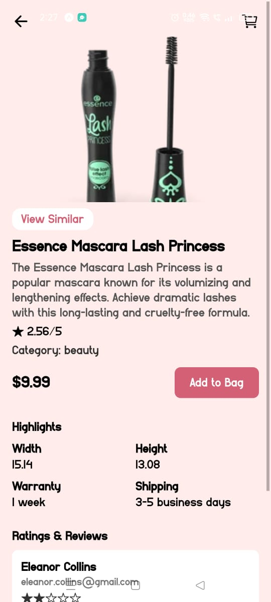
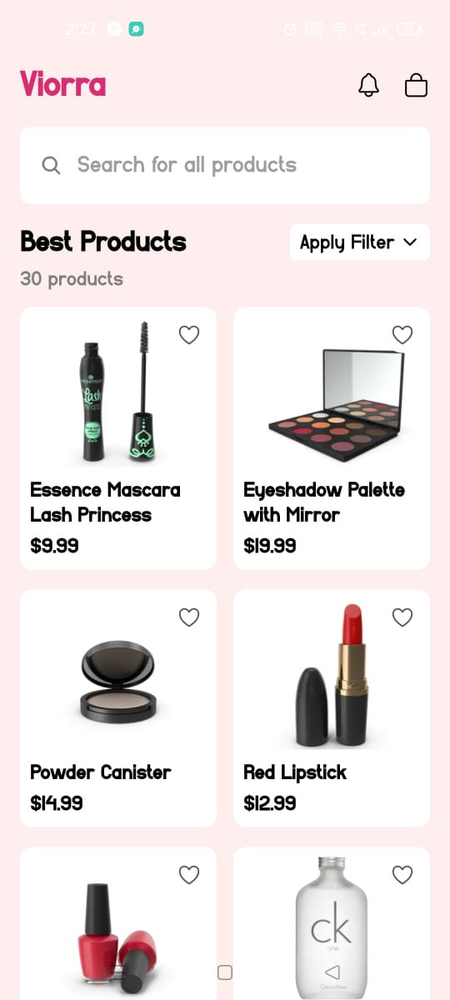

# 💄 GlowCart - Beauty E-commerce App

GlowCart is a modern and sleek beauty product shopping app built with **React Native** and **Expo Router**. It offers a seamless onboarding experience, product listing, and product detail pages with animations and theme support.

## ✨ Features

- 📱 Beautiful Onboarding & Login screens
- 🛍️ Product listing with lazy loading & fade-in animation
- 🌑 Light/Dark mode theme support
- 🧭 Navigation with Expo Router
- 💬 Product details, reviews, and highlights

## 📷 App Screenshot

<p align="center">
  
  
  
  
  
</p>


## 🛠️ Tech Stack

- React Native (Expo)
- Expo Router
- Framer Motion (Animations)
- Tailwind CSS (Optional Styling)
- DummyJSON API (Product data)

## 🚀 Getting Started

```bash
npm install
npx expo start
